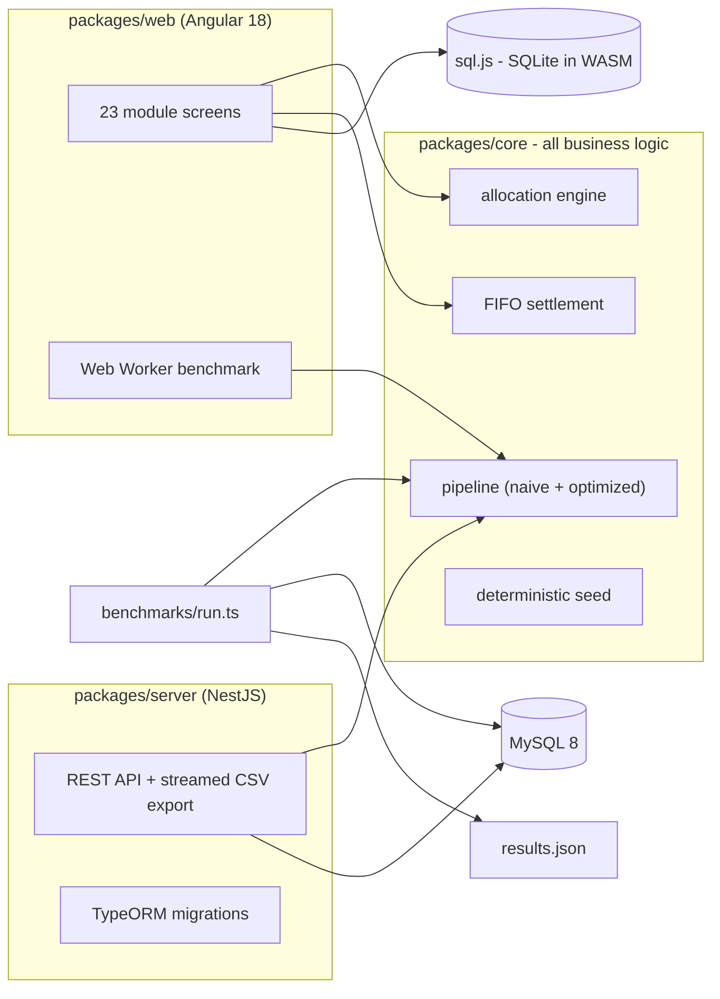

# enterprise-ops-demo

[](https://github.com/usama-hafeez/enterprise-ops-demo/actions/workflows/ci.yml)
[](https://github.com/usama-hafeez/enterprise-ops-demo/actions/workflows/benchmark.yml)


A complete operations system for a fictional laptop spare parts distributor
("Acme Parts"): customers, suppliers, manufacturers, product catalogue,
multi-warehouse stock, requisitions with real-time allocation, backorders,
invoicing, and FIFO payment settlement - 23 screens over a real relational
schema, running entirely in your browser.

**[Open the live demo](https://usama-hafeez.github.io/enterprise-ops-demo/)** -
no signup, no server; the whole system runs on SQLite compiled to WebAssembly,
seeded with deterministic synthetic data. Create a requisition and watch the
allocation engine fill it from four warehouses; record a payment and watch it
settle invoices oldest-first.

This repo backs the case study at
[usamahafeez.dev/case-studies/enterprise-business-system](https://usamahafeez.dev/case-studies/enterprise-business-system).
It is a clean-room demo: the production system it is modeled on is private and
employer-owned, so every schema, rule, and line of code here was written from
scratch, and all data is synthetic (numbered generic names on
`acme-parts.test`). The case study quotes production numbers; **this repo does
not repeat them** - every figure below comes from
[`benchmarks/results.json`](benchmarks/results.json), regenerated by CI on
every push.

## What's in the demo

| Module | Screens |
|---|---|
| Dashboard | KPIs, recent requisitions, largest outstanding invoices |
| Customers | list, detail (requisitions, invoices, balance, credit), create |
| Requisitions | list with status filters, detail (lines, allocations), **create - runs the real allocation engine** |
| Backorders | open demand the warehouses could not satisfy |
| Invoices | list with status filters, detail with FIFO payment applications |
| Payments | list, **record - runs the real FIFO settlement engine** |
| Products | searchable catalogue, detail with per-warehouse stock lots |
| Manufacturers | list, detail with catalogue parts |
| Suppliers | list with lead times, detail with supplied stock lots |
| Warehouses | list, detail with most valuable stock held |
| Stock | every lot, searchable, in-stock filter |
| CSV export | full allocation + settlement activity as a download |
| Performance | the same pipeline naive vs optimized, measured live |

Creates and edits are session-only: refresh and the seeded state is back.

## The business problem

A parts distributor takes requisitions (customer orders) with multiple lines.
Stock for the same part sits in four warehouses at different unit costs, some
lots flagged priority. Allocation must take priority stock first, then the
nearest warehouse, then the lowest cost - partially filling lines when stock
runs short and creating backorders for the remainder. Fulfilled requisitions
become invoices; incoming payments settle a customer's invoices oldest-first,
with partial payments, overpayments, and account credit handled exactly.

Two implementations of that pipeline live side by side in
[`packages/core`](packages/core):

- **naive** - how systems like this actually get written: a query per row
  inside nested loops, full-table loads into memory, no composite indexes.
  Correct, and an order of magnitude slower.
- **optimized** - batched `IN()`/`JOIN` reads, keyset pagination, multi-row
  writes, composite indexes matched to the access paths.

Both hash their complete business outcome; the benchmark fails if the hashes
ever differ.

## What made it hard

- **Proving equivalence.** An optimization that changes the output is a bug.
  Every allocation, backorder, invoice, and payment application is hashed in
  deterministic order; naive and optimized must produce identical hashes.
- **Concurrency without overselling.** N parallel allocations against the same
  stock row must never allocate more than exists. The API uses
  `SELECT ... FOR UPDATE` row locking, and the test suite demonstrates that
  the same workload *without* the lock does oversell.
- **FIFO settlement edge cases.** Partial payments, overpayments rolling into
  credit, payments spanning many invoices - covered by table-driven tests.
- **Measuring honestly.** Peak RSS is sampled in separate child processes per
  variant, because a process's memory high-water mark never shrinks and
  sharing one process would let the naive run mask the optimized run's
  footprint.

## Architecture



The business logic exists once, in core, behind a `DbExecutor` interface with
two implementations: MySQL (mysql2 pool - used by the NestJS API, the
benchmark, and CI) and sql.js (used by the unit tests and the entire browser
demo). The screens call the same `allocateLine` and `settlePayment` functions
the server runs. Migrations are real TypeORM migrations generated from one
canonical schema definition - no `synchronize: true`.

## Measured result

The Performance screen runs both pipeline variants in the browser; the
headline numbers come from MySQL 8 in GitHub Actions, written to
[`benchmarks/results.json`](benchmarks/results.json) on every push - seed 42,
12,500 products, 50,000 stock rows, 1,000 requisitions, 20,000 invoices,
5,000 payments:

| Metric | Naive | Optimized | Change |
|---|---:|---:|---:|
| Queries | 40,128 | 283 | -99.3% |
| Wall-clock | 28.3 s | 2.5 s | -91.1% |
| Peak RSS | 125.7 MB | 126.0 MB | +0.2% |

Both variants produced output hash `000035238af06cfc3b461a4f` - identical
business outcome: 4,135 allocations, 145 backorders, 999 invoices, 8,324
payment applications.

Honest caveats: query counts are deterministic, wall-clock depends on the
hardware (the same benchmark took 66.1 s naive / 2.9 s optimized on my slower
dev machine - a wider gap, because per-query overhead is higher there and the
naive variant pays it 40,128 times). Peak RSS is a wash at this volume -
Node's baseline dwarfs the working set. And these are this repo's numbers at
this seed volume, not the production system's figures, which this repo
deliberately does not quote.

## How to run

```bash
git clone https://github.com/usama-hafeez/enterprise-ops-demo.git
cd enterprise-ops-demo
cp .env.example .env
docker compose up
```

That brings up MySQL 8, the NestJS API on
[localhost:3000](http://localhost:3000) (migrated and deterministically
seeded on every start), and the web app on
[localhost:4200](http://localhost:4200).

Without Docker (Node 22+, MySQL 8 reachable with the `.env` credentials):

```bash
npm ci
npm run build          # all workspaces
npm test               # unit + e2e + concurrency suites
npm run bench          # reproduces the comparison table on your hardware
```

## What I'd change at 10x the volume

- **Queue the pipeline.** At 10,000+ requisitions per run, a request-scoped
  run is the wrong shape - move to a job queue with batch checkpoints so a
  crash resumes instead of restarting.
- **Partition the hot tables.** Invoices and payment applications grow
  without bound; partition by month and archive settled history.
- **Read replicas for reporting.** The CSV export and any analytics move off
  the primary.
- **Cursor-based idempotency.** Each batch writes its high-water mark so
  replays are safe.
- **Contention-aware allocation.** Row locks on hot SKUs become the
  bottleneck; shard allocation by warehouse or move hot-SKU allocation to a
  single-writer queue.

## What this demo doesn't handle

- Auth, multi-tenancy, and permissions - out of scope for a demo.
- Currency: everything is integer cents in one currency.
- Purchasing: suppliers and lead times are modeled, but there is no purchase
  order flow to replenish backordered stock.
- Warehouse "distance" is a seeded number, not real geography.
- Returns/refunds reversing settled invoices.
- The browser runs SQLite, not MySQL - the Performance screen explains what
  that changes and quotes the MySQL numbers from CI.
- Horizontal scaling: one API instance, one database.

## License

[MIT](LICENSE). All data is synthetic - numbered generic names
(`Customer 0001`, `Supplier 01`, `Manufacturer 01`) on `acme-parts.test`,
laptop part categories with no brand or model names. No real customers,
suppliers, manufacturers, or prices anywhere.
