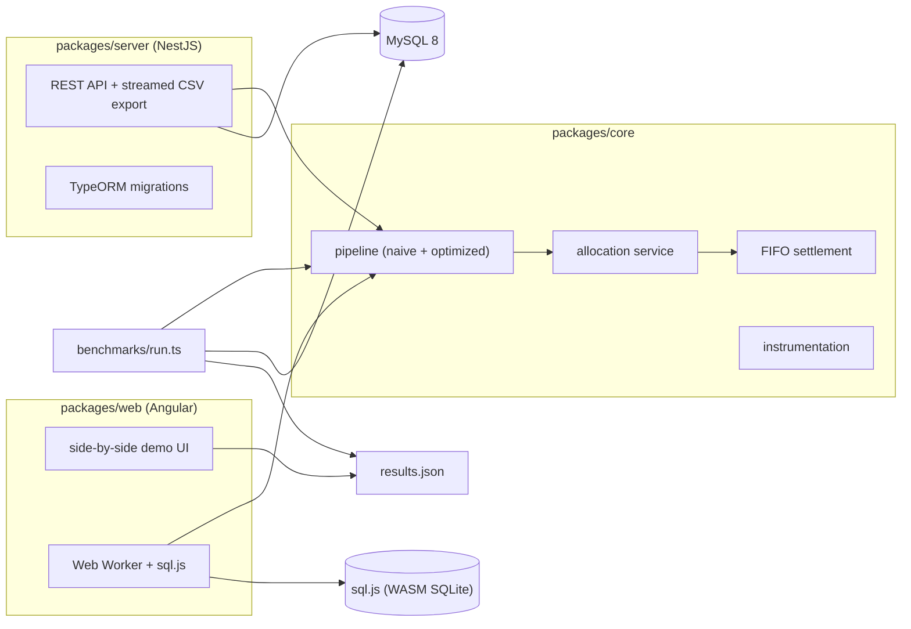

# enterprise-ops-demo

[](https://github.com/usama-hafeez/enterprise-ops-demo/actions/workflows/ci.yml)
[](https://github.com/usama-hafeez/enterprise-ops-demo/actions/workflows/benchmark.yml)


The same business pipeline implemented twice - a naive version and an
optimized one - with instrumentation that proves both produce identical
output, then measures the difference: **99.3% fewer queries, 95.5% less
wall-clock time** at this repo's seed volume.

This repo backs the case study at
[usamahafeez.dev/case-studies/enterprise-business-system](https://usamahafeez.dev/case-studies/enterprise-business-system).
It is a clean-room demo: the production system it is modeled on is private
and employer-owned, so everything here - schema, data, business rules, code -
was written from scratch for this repo. The case study quotes production
numbers; **this repo does not repeat them**. Every number below comes from
[`benchmarks/results.json`](benchmarks/results.json), produced by
[`benchmarks/run.ts`](benchmarks/run.ts) against MySQL 8 - regenerated and
committed back by the benchmark workflow on every push to main.

**[Live demo](https://usama-hafeez.github.io/enterprise-ops-demo/)** - runs the
same pipeline code in your browser on sql.js (WASM SQLite) with live query
counters. The browser run has no network round-trips, so the query counts
are the signal there; the MySQL numbers above are the headline.

## The problem

A requisition pipeline for a parts distributor: requisitions arrive with
multiple lines, stock is allocated across warehouses (priority stock first,
then nearest warehouse, then lowest unit cost, with partial allocation and
backorders), fulfilled requisitions become invoices, and incoming payments
settle invoices FIFO - including partial payments, overpayments, and
credits.

The naive implementation is how systems like this actually get written: a
query per row inside nested loops, full-table loads into memory, no
composite indexes. It is correct. It is also 22x slower here, and the gap
widens with data volume.

## What made it hard

- **Proving equivalence.** An optimization that changes the output is a
  bug. Both variants hash their complete business outcome (every
  allocation, backorder, invoice, and payment application, in
  deterministic order); the benchmark exits non-zero if the hashes differ.
- **Concurrency without overselling.** N parallel allocations against the
  same stock row must never allocate more than exists. The demo uses
  `SELECT ... FOR UPDATE` row locking inside transactions, and the test
  suite includes a demonstration that the same workload *without* the lock
  does oversell.
- **FIFO settlement edge cases.** Partial payments, overpayments rolling
  into credit, payments spanning many invoices - covered by table-driven
  tests.
- **Measuring honestly.** Peak RSS is sampled in separate child processes
  per variant (a process's high-water mark never shrinks, so sharing one
  process would let the naive run mask the optimized run's footprint).

## Approach

One core package, two implementations of the same pipeline interface:

| | naive | optimized |
|---|---|---|
| Row lookups | one query per row in a loop | batched `IN()` and `JOIN` |
| Data loading | full tables into arrays | streamed/batched cursors |
| Indexes | primary keys and FK indexes only | composite indexes matched to access paths |
| Writes | one `INSERT`/`UPDATE` per row | multi-row batches |

Everything runs through a `DbExecutor` interface with a MySQL
implementation (mysql2 pool, used by the NestJS API and the benchmark) and
a sql.js implementation (used by unit tests and the browser demo). An
instrumentation wrapper counts queries; a sampler tracks peak RSS; the
benchmark harness times both variants in fresh child processes and writes
`benchmarks/results.json`.

CSV export streams row batches through an async generator into the HTTP
response - the full dataset is never assembled in memory.

## Measured result

From [`benchmarks/results.json`](benchmarks/results.json) - MySQL 8.0.46,
seed volume: 12,500 products, 1,000 requisitions, 20,000 invoices, 5,000
payments (deterministic, seed 42):

| Metric | Naive | Optimized | Change |
|---|---:|---:|---:|
| Queries | 40,128 | 283 | -99.3% |
| Wall-clock | 66.1 s | 2.9 s | -95.5% |
| Peak RSS | 122.1 MB | 116.9 MB | -4.3% |

Both variants produced output hash `000035238af06cfc3b461a4f` - identical
business outcome: 4,135 allocations, 145 backorders, 999 invoices, 8,324
payment applications.

Two honest caveats. The peak-RSS difference is small at this volume -
Node's baseline dwarfs the working set; the queries and wall-clock columns
are where the design difference shows. And these are this repo's numbers
on the benchmark machine at this seed volume - they are not the production
system's figures, and this repo deliberately does not quote those.

## How to run

```bash
git clone https://github.com/usama-hafeez/enterprise-ops-demo.git
cd enterprise-ops-demo
cp .env.example .env
docker compose up
```

That brings up MySQL 8, the NestJS API on
[localhost:3000](http://localhost:3000) (migrated and deterministically
seeded on every start), and the web demo on
[localhost:4200](http://localhost:4200).

Without Docker (Node 22+, MySQL 8 reachable with the `.env` credentials):

```bash
npm ci
npm run build          # all workspaces
npm test               # unit + e2e + concurrency suites
npm run bench          # prints the comparison table, writes benchmarks/results.json
```

`npm run bench` reproduces the table above on your hardware - same seed,
same volumes, your machine's timings.

## How it fits together



The pipeline, allocation, and settlement logic exist once, in core.
MySQL (API, benchmark, CI) and sql.js (tests, browser) are just executors
underneath it.

## What I'd change at 10x the volume

- **Queue the pipeline.** At 10,000+ requisitions per run, a single
  request-scoped run is the wrong shape - move to a job queue with
  batch checkpoints so a crash resumes instead of restarting.
- **Partition the hot tables.** Invoices and payment applications grow
  without bound; partition by month and archive settled history.
- **Read replicas for reporting.** The CSV export and any analytics move
  off the primary.
- **Cursor-based idempotency.** Each batch writes its high-water mark so
  replays are safe.
- **Contention-aware allocation.** Row locks on hot SKUs become the
  bottleneck; shard allocation by warehouse or move hot-SKU allocation to
  a single-writer queue.

## What this demo doesn't handle

- Auth, multi-tenancy, and permissions - out of scope for a pipeline demo.
- Currency: everything is integer cents in one currency.
- Warehouse "distance" is a seeded number, not real geography.
- Returns/refunds reversing settled invoices.
- The browser demo runs SQLite, not MySQL - it exists to make the query
  counts visible, not to reproduce the headline timings.
- Horizontal scaling: one API instance, one database.

## License

[MIT](LICENSE). All data is synthetic (`customer0001@acme-parts.test`
and the like); no real customers, suppliers, or prices anywhere.
